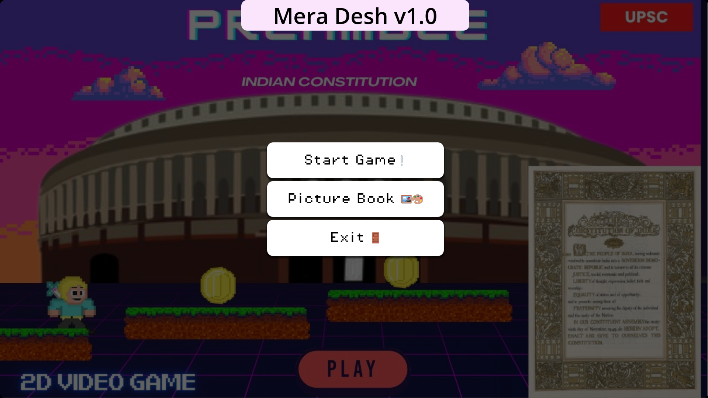
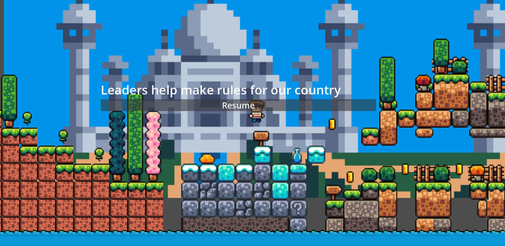

# 🇮🇳 Mera Desh v1.0  
_A gamified take on the Constitution of India – built in under 24 hours at IEEE SSH'24_

[**🌐 Play Now**](https://intenzi.dev/ieeessh) &nbsp;&nbsp;|&nbsp;&nbsp;⭐ **Star this repo if you like what you see!**  

---

## 🎯 About

**Mera Desh v1.0** is a 2D platformer designed to introduce children (9 years and younger) to the **Constitution of India** in a fun, engaging, and meaningful way.  
Built from scratch within **24 hours** as part of the **final round** of the **IEEE Sustainable Solution for Humanity (SSH) 2024** Hackathon.

---

## 👉 Key Features
- 📚 **Picture Book Mode**  
  Don’t miss this! From the **main menu**, you can dive into a **beautifully illustrated collection of visual comics**, crafted to simplify and **visually explain key elements of the Indian Constitution**.  
  Perfect for young minds who prefer a comic-style learning experience. It’s **not just a platformer – it’s an interactive library.**

- 📜 **Informative Signboards**  
  Learn fundamental rights and constitutional values through signboards scattered across levels of India!

- 🎮 **Platformer Progression**  
  A progressive gameplay loop inspired by classic platformers – accessible and enjoyable for young players.

- 🧠 **Interactive Quiz**  
  A non-graded quiz at the end which encourages **critical thinking** and **better memory recall**.

- 📷 **Camera Gesture Controls**  
  Real-world **gesture tracking using OpenCV** – jump IRL to jump in-game! A physical + digital learning blend.

---

## 🧱 Levels & Assets

- **Level 1**  
  Based on [Brackey's 2D platformer tutorial](https://www.youtube.com/watch?v=LOhfqjmasi0) for quick prototyping.

- **Level 2**  
  Custom-designed with **educational elements** and a new character.

- **Assets Used**  
  - 🎨 [Brackey's Platformer Bundle](https://brackeysgames.itch.io/brackeys-platformer-bundle)  
  - 🍂 [Four Seasons Platformer Tileset](https://rottingpixels.itch.io/four-seasons-platformer-tileset-16x16free)

---

## 🛠 Challenges Tackled

- 🎵 **Missing Background Music**  
  Solved audio playback problems for the web export.

- 😐 **Missing Emotes**  
  Implemented a fallback emote font to ensure text, emote rendering for the web export.

---

## 🖼 Screenshots

  

  

---

## 🚀 Try It Out

👉 **[Play it here](https://intenzi.dev/ieeessh)** – no installation needed!

Like what you see? Don’t forget to **🌟 star the repo** and share it!

---

## 📜 License

This project is for educational and non-commercial use under fair asset usage guidelines. Check individual asset licenses for more info.

---

Want to help improve it? PRs and feedback welcome! 🙌

---
